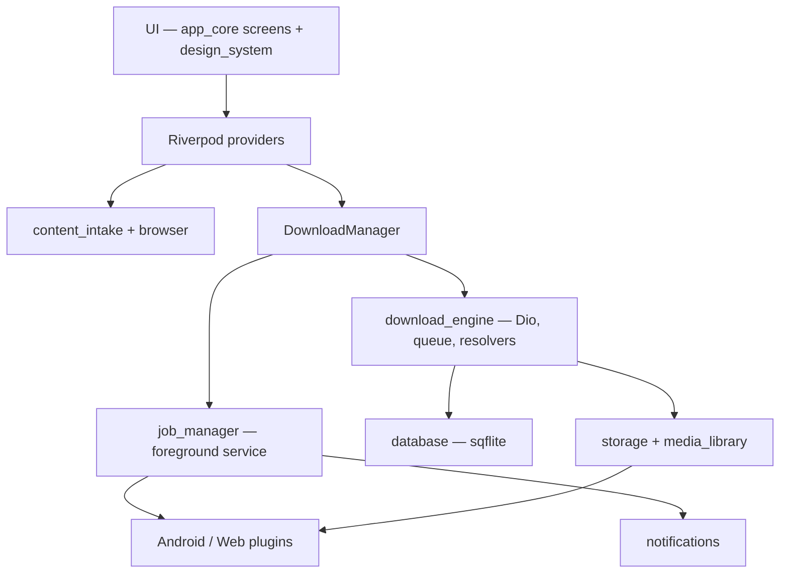

# UniversalDownloader

Flutter download manager for Android and the web. The shipping product name is **Downivo** — *Download. Manage. Enjoy.*

Public repository: [github.com/faisal-wahab-coder/downivo](https://github.com/faisal-wahab-coder/downivo)

## Overview

UniversalDownloader (Downivo) is an on-device download manager: paste or share a URL, resolve supported public media sources, queue the transfer, and organize the files. It exists so people can manage downloads, pause and resume them, and keep media in one local library instead of scattering files across browsers and share sheets.

It is aimed at Android users (with a reduced Flutter Web runner) who download videos, audio, documents, and other files they are authorized to access.

There is no account system and no backend. Everything runs on the device.

## Features

Only features that exist in the current codebase (`1.5.0+7`) are listed.

### Download Management

- Direct HTTP(S) downloads
- Queue with a maximum of 3 concurrent workers, reorder, and priority
- Pause / resume with HTTP Range, cancel, retry, pause-all / resume-all
- Progress UI (speed, ETA, remaining size), speed graph, and multi-segment view
- Optional speed limit, download scheduler, stall detection, and checksum verification
- Crash recovery and queue restore
- Download history with clear-history that keeps files on disk

### Media Downloads

- Sixteen social/media URL resolvers: YouTube, TikTok, Instagram, Facebook, X, Reddit, Pinterest, LinkedIn, Threads, SoundCloud, Vimeo, Twitch, Telegram, Snapchat, WhatsApp, and Dailymotion
- Save as Video or Audio after a video link is resolved
- Format / quality picker when a resolver returns multiple streams
- Resolvers fail clearly on auth walls, DRM, and private CDNs (they do not scrape private content)

### Queue Management

- Persistent queue in SQLite
- Network-loss auto-pause and reconnect resume
- Foreground service (`dataSync`) so transfers continue in the background on Android

### File Management

- Category folders (Videos, Images, Audio, Documents, Archives, APK, and others)
- Files tab: search, category filters, favorites, sort, user folders, and move-to-folder
- Open, share, rename, move, delete, and Open with another app
- Import detection for files added into managed folders
- Save to Gallery (photos and videos)
- Save audio from a video already in Files
- In-app image gallery and local audio/video viewer

### UI/UX

- Material Design 3, light / dark / system theme
- Five-tab shell (Home, Downloads, Files, Browser, Settings)
- Multi-step onboarding
- What's new dialog after updates
- Empty states and semantic labels on the main scaffold

### Performance

- TTL library-scan cache, throttled progress updates (250 ms)
- SQLite indexes, virtualized file lists
- Lifecycle-aware clipboard polling and downsized thumbnails
- Settings → Performance metrics panel

### Platform Integration

- In-app browser with tabs, history, bookmarks, and download detection
- Clipboard monitoring (opt-in) and clipboard history
- Android share target (URLs, text, files)
- QR scanner (camera)

## Supported Platforms

| Platform | Status |
| -------- | ------ |
| Android 10+ (API 29) | Shipping product |
| Flutter Web | Shipping runner with reduced native features |
| iOS | Not supported |
| Desktop | Not supported |

Web limits: downloads only while the tab is open; no camera, share target, or foreground service. Social URL resolution on web needs the local CORS proxy (`downivo/apps/web/tool/cors_proxy.dart`).

## Screenshots

Coming soon.

## Architecture

Thin Flutter runners (`apps/mobile`, `apps/web`) compose `packages/app_core`, which owns bootstrap, Riverpod providers, GoRouter, and screens. Domain work lives in feature packages.



See [docs/ARCHITECTURE.md](docs/ARCHITECTURE.md) and the as-built specs in [`documentation/`](documentation/README.md).

## Requirements

- Flutter **3.44+** / Dart SDK **^3.10.0** (strictest pin is `apps/mobile` and `job_manager`)
- Android SDK, **minSdk 29**, Java **17**
- Optional: [Melos](https://melos.invertase.dev/) 8 for workspace scripts
- Optional: Firebase `google-services.json` and PostHog `--dart-define` for live telemetry (the app runs without them)

This is a Dart/Flutter monorepo. There is no npm/Node runtime requirement for the app.

## Installation

```bash
git clone https://github.com/faisal-wahab-coder/downivo.git
cd downivo/apps/mobile
flutter pub get
flutter run
```

Web:

```bash
cd downivo/apps/web
dart run tool/cors_proxy.dart   # terminal 1, for social URL resolution
flutter pub get
flutter run -d chrome           # terminal 2
```

Copy [`.env.example`](.env.example) for optional analytics and signing notes. Do not commit real keys.

## Development

1. Clone the repository
2. Install the Flutter SDK matching the constraints above
3. `cd downivo/apps/mobile && flutter pub get`
4. Optional: copy `apps/mobile/android/app/google-services.json.example` and Firebase/PostHog keys as documented in [docs/DEVELOPMENT.md](docs/DEVELOPMENT.md)
5. `flutter run`
6. Tests: from `downivo/`, `bash scripts/ci.sh` (pub get, analyze, test)
7. Format: `melos run format` from `downivo/` (requires Melos)
8. Release APK for testing: `bash downivo/scripts/build_release_apk.sh --open`

Full setup, debugging, and troubleshooting: [docs/DEVELOPMENT.md](docs/DEVELOPMENT.md).

## Project Structure

```
.
├── documentation/          # As-built product and architecture specs
├── docs/                   # Open-source contributor guides
├── downivo/                # Flutter Melos workspace
│   ├── apps/mobile/        # Android app (pub name: downivo)
│   ├── apps/web/           # Flutter Web app
│   ├── packages/           # Feature and infrastructure packages
│   ├── scripts/ci.sh       # Analyze + test
│   ├── scripts/build_release_apk.sh  # Sideload Android release APK
│   └── qa/                 # Manual QA cases and local fixture server
└── .github/                # CI, issue and pull request templates
```

## Contributing

Community contributions are welcome. Please read [CONTRIBUTING.md](CONTRIBUTING.md) before opening a pull request.

## Roadmap

See [docs/ROADMAP.md](docs/ROADMAP.md). Product history lives in [`documentation/25_Roadmap.md`](documentation/25_Roadmap.md).

## Issues

Use [GitHub issues](https://github.com/faisal-wahab-coder/downivo/issues):

- Bugs — [bug report template](.github/ISSUE_TEMPLATE/bug_report.md)
- Features — [feature request template](.github/ISSUE_TEMPLATE/feature_request.md)
- Performance and documentation problems — same templates; label them accordingly

Search existing issues first. Do not include passwords, API keys, tokens, or personal data in reports.

## Security

Please see [SECURITY.md](SECURITY.md). Do not open public issues for vulnerabilities that include exploit details.

## License

[MIT](LICENSE) © 2026 Faisal Wahab.

Third-party Flutter/Dart packages keep their own licenses (typically BSD, MIT, or Apache-2.0).

## Acknowledgements

Built with Flutter, Riverpod, GoRouter, Dio, sqflite, and the packages listed in [`documentation/28_Dependencies.md`](documentation/28_Dependencies.md).

Download only content you are authorized to access. Do not use this project to circumvent DRM, paywalls, or private authenticated CDNs.
