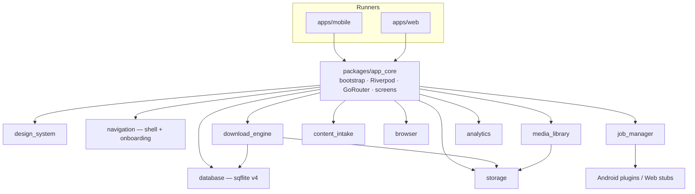

# Architecture

This describes the **as-built** Flutter app, not the older React Native drafts. Deeper specs: [`documentation/11_Technical_Architecture/`](../documentation/11_Technical_Architecture/README.md).

## High-Level Architecture

There is **no application server**. Metadata is SQLite; bytes are files on disk (or the web file store).

## Application Layers

| Layer | Where | Rule |
| ----- | ----- | ---- |
| Presentation | `app_core/lib/src/features/*`, `navigation`, `design_system` | Widgets call providers and package APIs |
| Application | Riverpod providers, `DownloadManager`, intake handlers | Orchestrates use cases |
| Domain | `shared_types`, engine models (`DownloadTask`, `DiscoveredResource`) | No Flutter UI |
| Data | `database`, `storage`, Dio in `download_engine` | Persistence and HTTP |

Dependencies flow inward. `design_system` must not contain download or database logic.

## Download System

`DownloadManager` (`packages/download_engine`):

1. Validate URL
2. Resolve via `ContentProviderRegistry` (social) or treat as a direct file URL
3. Choose filename
4. Persist a row through `DownloadRepository` → sqflite
5. Run up to **3** concurrent Dio downloads
6. Write through `FileStore` into a category folder
7. Pause/resume (HTTP Range), cancel, retry, reorder, pause-all / resume-all
8. Restore the queue on startup
9. `clearHistory` deletes terminal DB rows and **keeps files**

Progress is throttled (~250 ms) before it hits the UI.

## Queue Management

In-memory maps plus `_queueOrder`. Status lives on `DownloadTask` (`shared_types` / engine). `job_manager` binds the same manager to `flutter_foreground_task` and `connectivity_plus` so Android can keep working when the UI is backgrounded.

## Storage

`storage` defines `StoragePaths` and `FileStore`. Categories include Videos, Images, Audio, Documents, Archives, APK, QR Downloads, Favorites, Vault, Temp, Logs. `media_library` scans those folders, favorites, and file actions (open, share, rename, move, delete, save to gallery via `gal`).

Web uses a memory/web file store and `sqflite_common_ffi_web` plus `web/sqlite3.wasm`.

## Networking

Dio is created inside the engine (`createEngineDio()`). Timeouts: connect 30s, receive 30m (as documented in `documentation/11.4`). Social resolvers issue additional HTTP/HTML/GraphQL calls. Flutter Web cannot set `User-Agent` freely; `apps/web/tool/cors_proxy.dart` is a **loopback** reverse proxy for development.

Do not add a general-purpose networking package; Dio stays in `download_engine`.

## State Management

**Riverpod only.** Bootstrap overrides:

- `sharedPreferencesProvider`
- `appInitializerProvider`
- `defaultStoragePathProvider`
- `downloadManagerProvider`
- `goRouterProvider`

`DownloadManager.tasksStream` is the live queue bus (no separate event-bus package).

## UI

Five tabs: Home, Downloads, Files, Browser, Settings. Search is a pushed route, not a tab. Screens live under `app_core/lib/src/features/`. Theme tokens live in `design_system`. Do not add a sixth tab without a maintainer decision.

## Platform-specific Code

Conditional imports (examples):

- SQLite init: io / web / stub
- Share intake: io / stub
- QR navigation: io / stub
- File store factory: io / web

Android: `minSdk 29`, foreground service `dataSync`, share intent-filters, notifications, camera. Web: no FG service, camera, or share target.

## Error Handling

Dio failures go through `download_error_formatter.dart`. User-visible errors use SnackBar or `EmptyState`. Per-task `CancelToken`. Social resolvers return typed failures (auth required, private CDN, DRM) rather than scraping private media.

## Performance Considerations

`packages/performance`: TTL cache, LRU, `ThrottleGate`, startup metrics. Library scans are cached; lists are virtualized. See Settings → Performance.

## Security Considerations

- No accounts, no cloud sync of the library
- Clipboard monitoring is a settings toggle
- Analytics sanitizer strips URLs and token-like strings
- Firebase/PostHog no-op without keys
- R8 minify + shrink on Android release
- Signing material is local (`key.properties`)

## Extensibility

| You want to… | Put code in… |
| ------------ | ------------ |
| New screen | `app_core/lib/src/features/<name>/` + route in `app_router.dart` |
| New setting | `settings_provider.dart` + Settings UI |
| New social site | `download_engine/lib/src/content_providers/` + registry + tests |
| New file action | `media_library` then Files UI |
| Crash/event | `analytics` `AnalyticsService` only — never send raw URLs |

Promote an empty stub package into `melos.yaml` only when it has real Dart and tests. Do not resurrect Collections / Activity Center from old UX specs without an issue.

Contributor workflow: [FEATURE_DEVELOPMENT.md](FEATURE_DEVELOPMENT.md).
